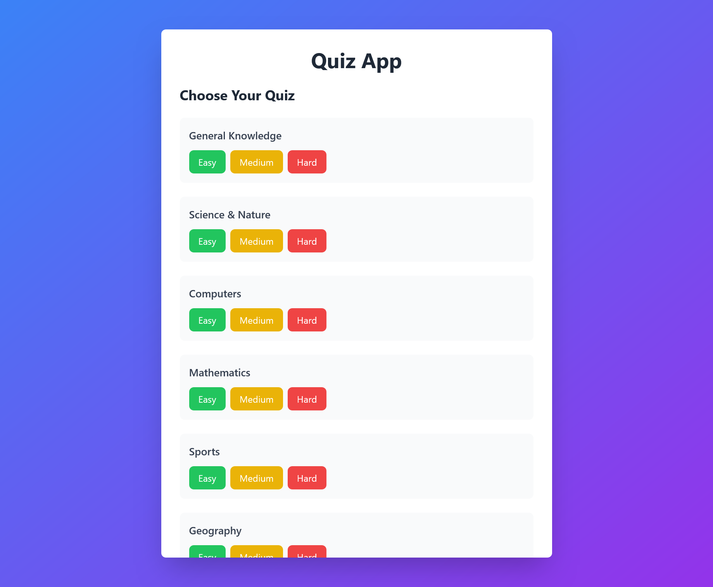
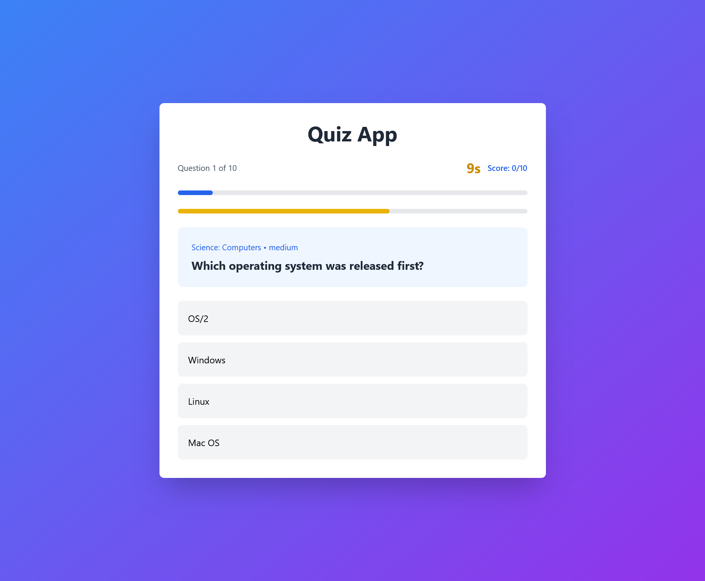
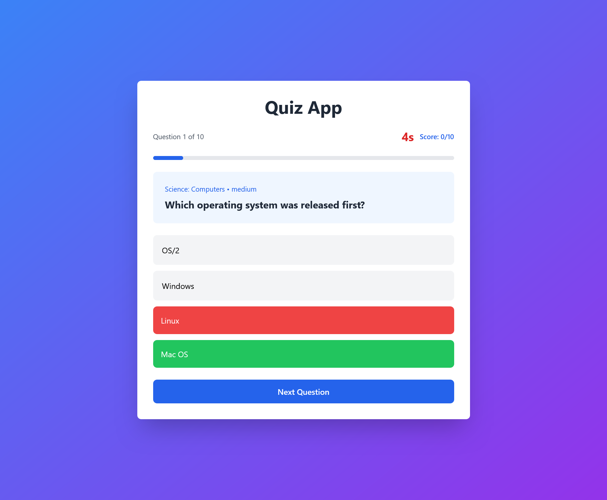
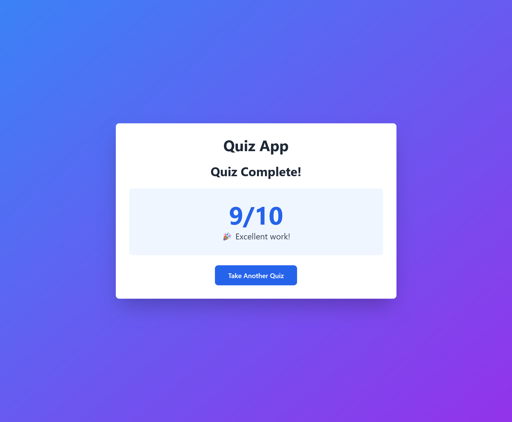

[](https://securityscorecards.dev/viewer/?uri=github.com/Lujens/Quiz-App)
[](https://www.bestpractices.dev/projects/12548)

# Quiz App

A web-based trivia quiz application built with React and TypeScript

## 🎯 Project Overview

This quiz app allows users to:
- Select from 8 different quiz categories (General Knowledge, Science & Nature, Computers, Mathematics, Sports, Geography, History, Animals)
- Choose difficulty levels (Easy, Medium, Hard)
- Answer 10 multiple-choice trivia questions
- Track their score in real-time
- Experience a 15-second countdown timer per question
- Receive immediate feedback on correct/incorrect answers
- View their final score with performance feedback

## 🛠️ Tech Stack

- **React 18** - UI framework
- **TypeScript** - Type safety and better developer experience
- **Vite** - Fast build tool and dev server
- **Tailwind CSS** - Utility-first CSS framework for styling
- **Open Trivia Database API** - Question source (https://opentdb.com/)

## 🚀 Getting Started

### Prerequisites
- Node.js (v20.19.0 or higher recommended)
- npm

### Installation
```bash
# Clone the repository
git clone https://github.com/Lujens/Quiz-App.git
cd Quiz-App

# Install dependencies
npm install

# Start development server
npm run dev
```

Open [http://localhost:5173](http://localhost:5173) in your browser.

### Build for Production
```bash
npm run build
npm run preview
```

## 📁 Project Structure
```
quiz-app/
├── src/
│   ├── components/
│   │   ├── CategorySelection.tsx  # Category and difficulty selection UI
│   │   └── Quiz.tsx               # Main quiz component with timer
│   ├── services/
│   │   └── triviaApi.ts           # API service and TypeScript types
│   ├── App.tsx                    # Main app component with state management
│   ├── index.css                  # Tailwind CSS imports
│   └── main.tsx                   # App entry point
├── public/                        # Static assets
├── index.html                     # HTML template
├── tailwind.config.js             # Tailwind configuration
├── postcss.config.js              # PostCSS configuration
├── tsconfig.json                  # TypeScript configuration
└── package.json                   # Dependencies and scripts
```

## ✨ Features Implemented

### Core Features
- ✅ Category selection with 8 different topics
- ✅ Three difficulty levels (Easy, Medium, Hard)
- ✅ 10 multiple-choice questions per quiz
- ✅ Real-time score tracking
- ✅ Immediate visual feedback (green for correct, red for incorrect)
- ✅ Progress bar showing quiz completion
- ✅ Final results screen with performance message

### Frontend Enhancement
- ✅ **Timer Feature**: 15-second countdown per question with visual timer bar
  - Color-coded timer (green → yellow → red)
  - Auto-advance when time expires
  - Shows correct answer when timeout occurs

## 🎨 Design Decisions

### API Rate Limiting Strategy
The Open Trivia Database API has rate limits (5 seconds between requests). I implemented:
- **In-memory caching** to avoid repeated requests for the same category/difficulty
- **Minimum request interval enforcement** (5 seconds between API calls)
- **User-friendly error messages** when rate limits are hit

### TypeScript Type Safety
Used strict TypeScript types throughout:
- Defined interfaces for API responses (`TriviaQuestion`, `TriviaApiResponse`)
- Type-safe category names using `keyof typeof`
- Proper typing for all component props and state

### State Management
Chose React's built-in state management (useState) for simplicity:
- Single source of truth in App.tsx
- Props drilling for communication between components
- Clean separation of concerns (UI vs. logic)

### Styling Approach
Used Tailwind CSS for:
- Rapid prototyping and iteration
- Consistent design system
- Responsive layout without custom CSS
- Built-in transitions and animations

## 📸 Screenshots

### Category Selection

*Choose from 8 categories and 3 difficulty levels*

### Quiz in Action

*15-second timer with color-coded countdown bar*

### Answer Feedback

*Immediate visual feedback with correct answer highlighted*

### Results Screen

*Final score with performance feedback*

## 🧪 Development Process

### Challenges Faced

1. **API Rate Limiting**
   - **Problem**: Open Trivia Database has strict rate limits causing 429 errors
   - **Solution**: Implemented caching and enforced minimum request intervals

2. **Timer State Management**
   - **Problem**: Timer continued counting on subsequent questions causing timeout issues
   - **Solution**: Added proper cleanup in useEffect and reset timer in handleNext()

3. **Answer Shuffling**
   - **Problem**: Answers re-shuffled on every render causing UX issues
   - **Solution**: Moved shuffle logic to useEffect with proper dependencies

4. **React StrictMode Double Rendering**
   - **Problem**: Questions were being replaced after 3 seconds in development
   - **Solution**: Removed StrictMode for stable behavior during development

5. **Tailwind Configuration**
   - **Problem**: PostCSS configuration conflicts between Tailwind v3 and v4
   - **Solution**: Downgraded to stable Tailwind v3 with standard PostCSS setup

## 🔄 Future Improvements

If I had more time, I would add:
- **Leaderboard feature** (requires backend/database)
- **Multiple quiz sessions** with history tracking
- **Hints system** that reduces points when used
- **Sound effects** for correct/incorrect answers
- **Animations** for transitions between questions
- **Difficulty-based scoring** (harder questions worth more points)
- **Social sharing** of results

## 📝 Testing

Manual testing was performed for:
- ✅ All category/difficulty combinations
- ✅ Timer countdown and auto-advance
- ✅ Correct/incorrect answer feedback
- ✅ Score calculation accuracy
- ✅ Progress bar updates
- ✅ Results screen display
- ✅ Error handling for API failures
- ✅ Responsive design on different screen sizes

## 👤 Author

**Lujens** - Direct Supply Internship Application 2026

## 📄 License

This project is open source and available for educational purposes.
